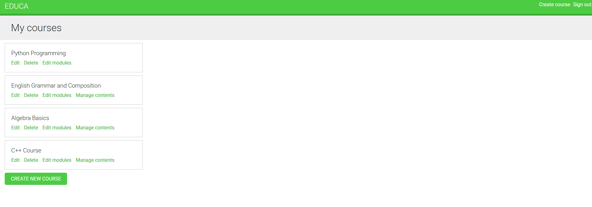
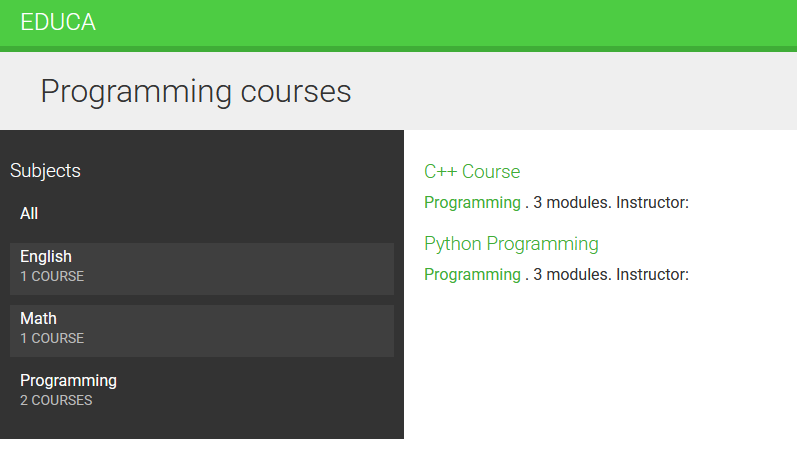
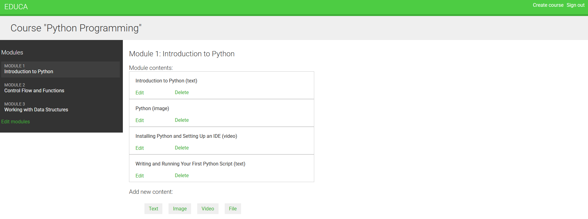
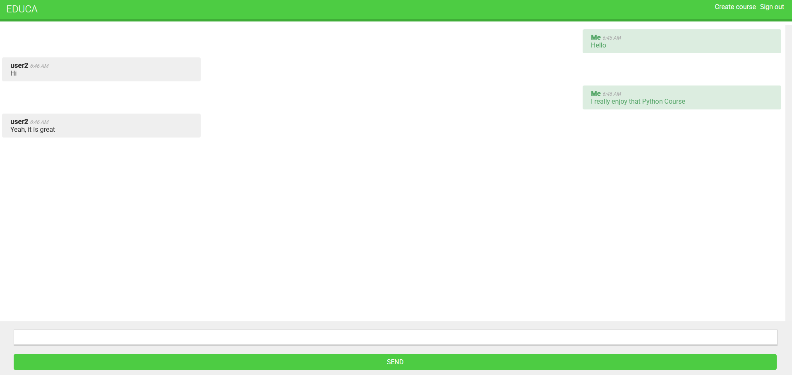

# 🎓 Education Platform 📚✨

A **Django-based education platform** that allows instructors to **create and manage courses** with **modules and various content types**. Students can enroll in courses, access learning materials, and communicate via a **real-time chat**. The platform also includes a **REST API for course enrollment**.  

## 🚀 Features  

✅ **Course Management** – Create, update, and manage courses  

 
✅ **Modular Structure** – Organize content into modules and sections 
 
✅ **Multiple Content Types** – Add **Text, Videos, Images, and Files** to modules  
✅ **Student Chat** – Real-time messaging using **WebSockets**  
 
✅ **DRF API** – Allows students to **enroll in courses** via API  

---

## 🛠️ Tech Stack  

- **Backend:** Django, Django REST Framework (DRF)  
- **Database:** SQlite  
- **Real-time Chat:** Django Channels (Layers - Redis)


## 📦 Installation & Setup

### 1. Create & Activate Virtual Environment
```bash
python -m venv venv
source venv/bin/activate  # On Windows use `venv\Scripts\activate`
```

### 2. Install Dependencies
```bash
pip install -r requirements.txt
```

### 3. Run Migrations, Load mock data, Create Superuser
```bash
python manage.py migrate
python manage.py loaddata fixtures/db.json
python manage.py createsuperuser
```

### 4. Setup Redis to use chat

### 5. Run the Development Server
```bash
python manage.py runserver
```


## 🎥 Managing Courses and Content  

### ➤ **Creating a Course**  
- Instructors can create courses and assign subjects.  
- Each course can have multiple **modules**.  

### ➤ **Adding Content to Modules**  
Each module can contain **four types of content**:  
✔️ **Text** – Lessons in text format
✔️ **Video** – Embedded videos  
✔️ **Image** – Add images to enhance lessons  
✔️ **Files** – Upload files

### ➤ **Student Enrollment**  
Students can enroll in courses via:  
1️⃣ **Web Interface**  
2️⃣ **REST API** (via DRF)  


## 💬 Real-Time Chat for Students  

🔹 **Built with WebSockets & Django Channels**  
🔹 **Students can communicate within courses**  
🔹 **Live chat updates without refreshing the page**  